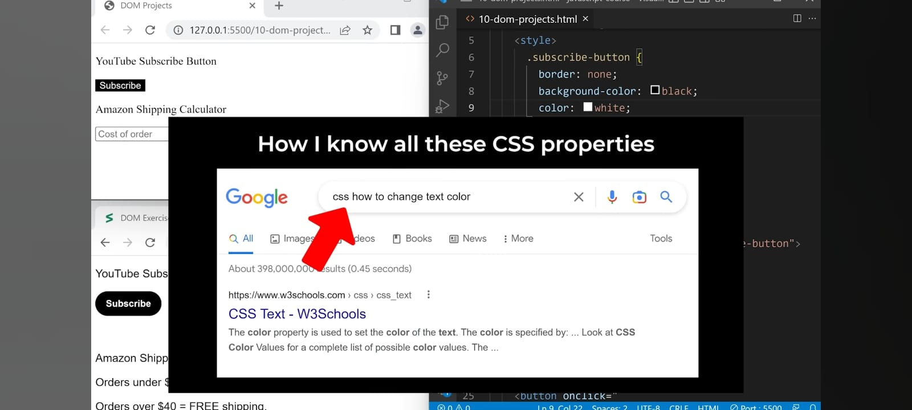

<u>**HTML, CSS< and JavaScript together:-**</u>

CSS Selectore:
*WHich elements we want to style.*
.css{
  border: none;
  Property: value//Property-value pair
}

<u>**Finding CSS properties:-**</u>

**padding:-**
*Space on the inside.*

**margin:-**
*Space on the outside.*

- .classList: *It's an object which gives us control of the class attribute.*
- add(): *It adds class to an element.*
Like; classList.add(..);

- rgb(red, green, blue);: rgb is red, green, blue. The colors whose mix we always use. Its range is between '0 - 255'.
0 = Less color, darker
255 = More color, lighter
Like; rgb(240, 240, 240);

- .remove(): This is used to remove the added class.
Like; classList.remove(...);