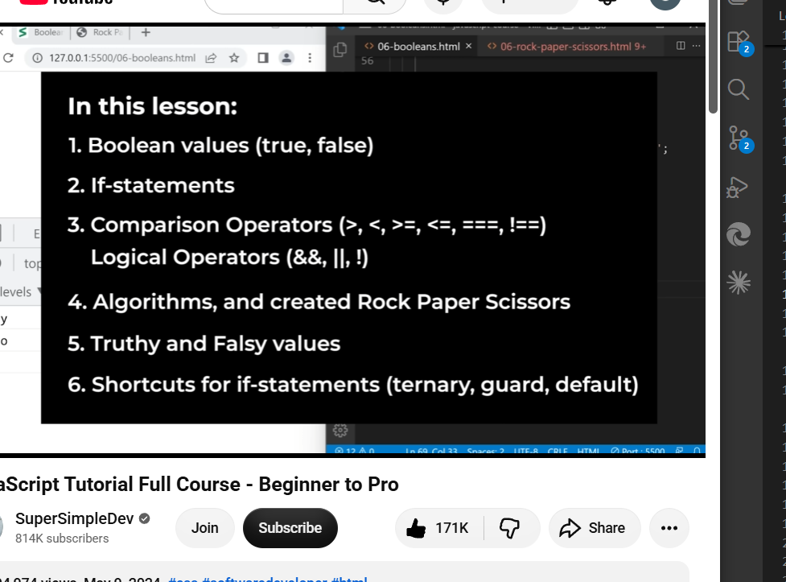

Booleans & If-Statements :-

What are Booleans :-

Booleans are another type of value in JavaScript.
There are only 2 boolean values: 'true' or '1', 'false' or '0'.

Purpose of Boolean Values :-
A Boolean value represents whether something is 'true' or 'false'.
 
Syntax rule for Boolean :-

To create a boolean, we just type true or false. 
We don't surround true or false with quotes because it'll become a String.

Comparison Operators :-
>: Greater than.
<: Less than.
>=: Greater than equal to.
<=: Less than equal to.
===: equal to.
!==: Not equal to.

=: Assign Values.

JavaScript has two equals to check; === & == :- We always use ===.

'==' is used to check if the values are equal, so it does by converting both the values into the same, means by doing 'type conversion' automatically. 
Like; console.log(5 == '5') // true
While '===' is used to do strict equality. It does not do type conversion.
Like; console.log(5 == '5') //false.

Note: !== & != :- It's same as === & ==. !== is used always.

If-Statements :-

Lets us write multiple group of code.
And then decide which code to run.

Syntax rules for if statements :-

To create a if-statement, we have to write,
'if' with parenthesis containing boolean value inside and then run the code inside the curly brackets.
We can also use an 'else' statement, it will only run when the 'if' condition is false.
"The 'else' statement is optional."

Format:
if(Condition){
  console.log(statements); //Branches
}
else{
  console.log(statements); //Branches
}

When there is only one line of code inside 'if' and 'else' statements then there is no need of {}. But if there is more than one line, {} is necessary.

else if statement :-
We can have more than one statement.
We use 'else if' after 'if'.

Format:
if(Condition){
  console.log(statements); //Branches
}
else if(Condition){
  console.log(statement)
}
else{
  console.log(statements); //Branches
}

For Rock Paper Scissor :-
Use "Math.random()" for computer's move. 
Take randomNumber between 0 to 1 as Math.random() does. So if random Number between,
1. 0 to 1/3: Rock
2. 1/3 to 2/3: Paper
3. 2/3 to 1: Scissor
Here we are ot comparing computer's move withuser's move.

**Algorithm:**
when we click a button between Rock, Paper, Scissor,
1. Computer makes it's move randomly and choose one of the three.
2. Then computer's and user's move is compared.
3. Now, create a popup to show the result of who win or lose or it was a tie.

Logical Operators:
Logical operators let us combine booleanvalues. (Not only for boolean values though).

1. And operator (&&): It checks if both values are true then only it'll give true.
`console.log(true && false);`//false
2. Or operator (||): It checks the values and if one of both is true, it'll give true.
`console.log(true || false);`//true

3. Not Operator (!): It checks the value and if it's true, it'll give false and if the value is false it'll give true.  
`console.log(!true);`//false  
`console.log(!false);`//true

**<u>Operator Precedence :-</u>**
1. (...)
2. * /
3. + -
4. Comparison operators.
5. Logical operators.

**Scope:-**  
*A Scope limits where a variable exists.*  
*Any variabe we create inside {..} will only exist inside the same {..} only and if we use that variable outside the {scope}, it will give error that not declared.*  
- *Scope helps us avoid 'name conflicts'.*

<u>**Strategies for JavaScript:-**</u>

1. Figure out what steps we need.
2. Convert these steps into code.

**Truthy and Falsy values:-**

Truthy: *It behaves like true.*
Falsy: *It behaves like false.*

Example:  
`const cartQuantity = 5;`  
`if(cartQuantity){`  
`console.log('cart has products');`  
`}`  
*/It'll depend on the value. If it's true, the statement will print else not print. Using Truthy and Falsy here.*  

<u>**Falsy Values:-**</u>
false, 0, Nan, '', undefined, null.  
*Any value not on this list is truthy.*

Nan: When there is no valid calculation in maths, 'Nan' is given.
Example: console.log('text' / 5); /Nan

undefined: When a variable is not defined, means it doesnt have a value.
Example: 
let Variable1;
console.log(Variable1);//undefined
- We can't define undefined with 'const'. To do that we have to do;
const Variable1 = undefined;
console.log(Variable1);

<u>**Use of Truthy and Falsy in Logical operator:-**</u>

And Operator(&&):
It checks if both values are Truthy.
*Using Truthy and Falsy in Add operator, if it gets the first valy=ue as true, it'll check the second value too. And if the second will also be true, then anly it'll give true as an answer or 'the second value as an answer'.*
Example:
console.log( 5 && 4 ); //4. It's the second value.

Or Operator(||):
It checks if one of two values is truethy.
*Using Truthy and Falsy in Or operator, if it gets the first as true then it'll not check the next value and directly give the truth as an output in console. This is also known as "Short-circuit".*
*If it gets false for first value, it'll definitely check the next value, and if it's true then only it'll give the output.*

Not Operator(!):
*There is no value more than one, so it doesn't need to check another one.*

<u>**Shortcut for if-Satement:-**</u>

1. Ternary Operator:
Ternary operator is used to get condition and expressions all in one line. We can save a Ternary operator in a variable.
Format:
condition ? Expression1 : Expression2
In this, if condition is truthy, Expression1 will be displayd else Expression2 will be displayed.

Example:
const age = 12 ? 'truthy' : 'falsy';
console.log(age);

 2. Guard Operator:
 Add Operator &&, in this when there is (false && value2), value2 is not even checked because as false is present, it's impossible for both sides to be truthy. So it directly displays false.
 - It stops early.
 - Doesn't need to run the code on the right.
 *This is also called a Short-circuit evalutaion.

 Example:
 console.log(false && 7);//false
 console.log(0 && 7);//0
 We can use it like;
 false && console.log('hello');// Because the left side is already 'false', the right will not be checked and false will be given.
 We can save it in a variable too.

const fact = false && 5;
console.log(fact);//false

3. **Default Operator:**  
*We call or operator as Default operators too.
Or Operator ||, its same as guard operator, the left side is already true
We already know the result will be true, so no need to check the right side.*
- Stops early(shot-circuit).
- It already gives the left value when its true and not even check lright side even if it'll be true.

Format:
const age = true || value2;

Example:
1. const msg = 5 || false;
console.log(msg);//5
2. const age = true || 5;
console.log(age);//true
3. const currency = 'USD' || 'RS'
console.log(currency);//USD
4. const currency = undefined || 'RS'
console.log(currency);//RS  
  
<u>**Conclusion of Lesson 6:-**</u>
