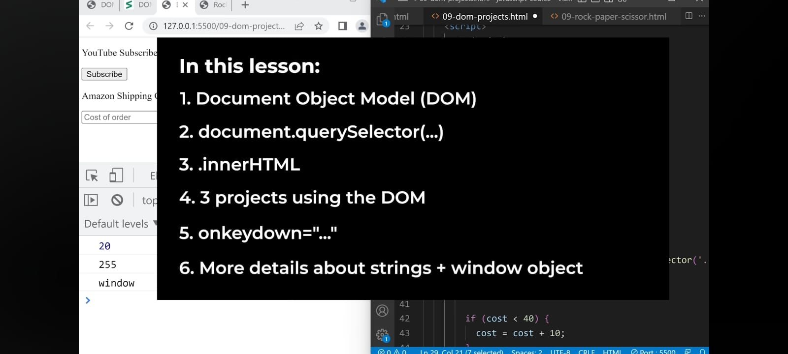

<u>**DOM:-**</u>
DOM = another built-in object
"Document object"

  document.body.innerHTML = 'hello';//This removes everything from page and displays only 'hello'.      
Here, 
document: Built-in object
body: The body is an object inside document
innerHTML: An object inside body.

  document.title = 'Hello';//It changes the title of page

  *The document object represents / models the webpage. That's why DOM is*"Document Object Model".

  'document' is built in object that's interconnected/linked to webpage and changes things on page and gets things from it too.

  console.log(document.body);//It gives the whole body in the console.
*We can have HTML elements inside JavaScript.Th DOM combines HTML and JavaScript together.*

*When HTML element is inside JAvaScript, it converts into JavaScript object.*
  console.log(typeof document.body);//object

console.log(document.body.innerHTML);//innerHTML gves all the HTML inside the body to console in JavaScript.

*We can give HTML code to innerHTML too.*
console.log(document.body.innerHTML = '<button>Change</button>')//<button>Change</button>

document.querySelector(): It let us get any element and put it inside the JavaScript.

- Every HTML element has a property .innerHTML

- DOM combines JS & HTML together. It gives JS full control of the webpage.

- document.innerText is used for text to be count only even if there is space inbetween or beside them.

- 
 is a block element that takes an entire line by itself.

- <input> is a self-closing element.

- Doing element.value gives the value.

- Number(), String() are built-in functions that convert other types into themselves.

- "onkeydown" is used to show that keys are being used.
*onkeydown= "console.log('typing');* 
- To show the key we use 'event'. 'event' is an object provided by JavaScript that contains the info about the event.

clicks and keydownare known as 'events'.
onclick, onkeydown are known as 'event listeners'.

- event Listeners: *Every eventy listener gets an event object.*
onclick = click
onkeydown = key press
onscroll = scrolling
onmouseenter = hover over
onmouseleave = stop hovering over
...many more

- String(): 
If a string only contains a number, and we do '-*/' => It will be converted into a number.
Like;
String(25);//Now 25 as an string can be used to '-*/' with a number.
console.log('25'-5)//20
console.log('25'*5)//125
console.log('25'/5)//5
*This all are 'Type Coercion'.*
- But it's better not to do maths using strings until necessary.
console.log('25'+ 5)//'255' (Concatenation)

**window object:-**
*window object is the whole window, it connects everythind in code to window.*
window.console.log('window');
window.document.body.innerHTML('hello')
window.alert('Hi!');

*Everything in JavaScript is written with window.*
- We don't have to "window." JavaScript will automatically add it.

<u>**Conclusion of Lesson 9:-**</u>
